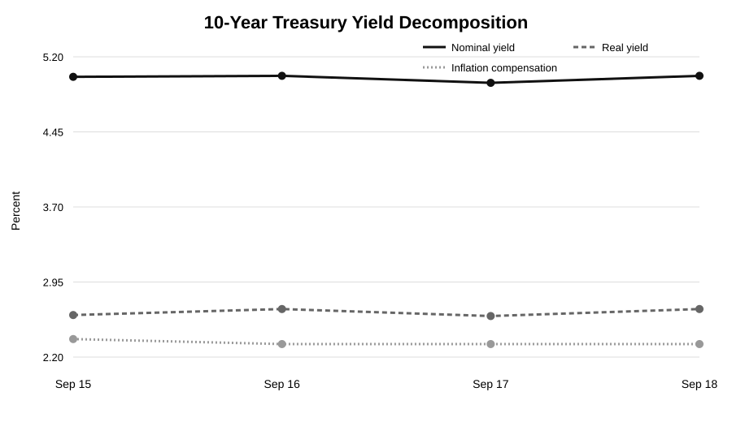
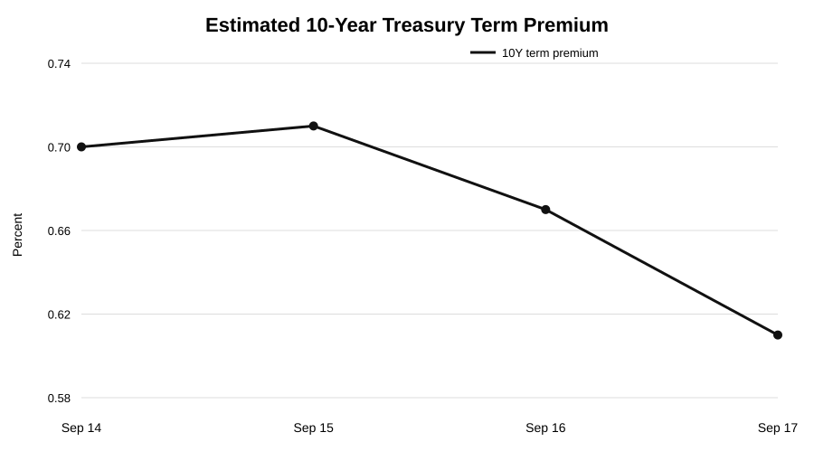
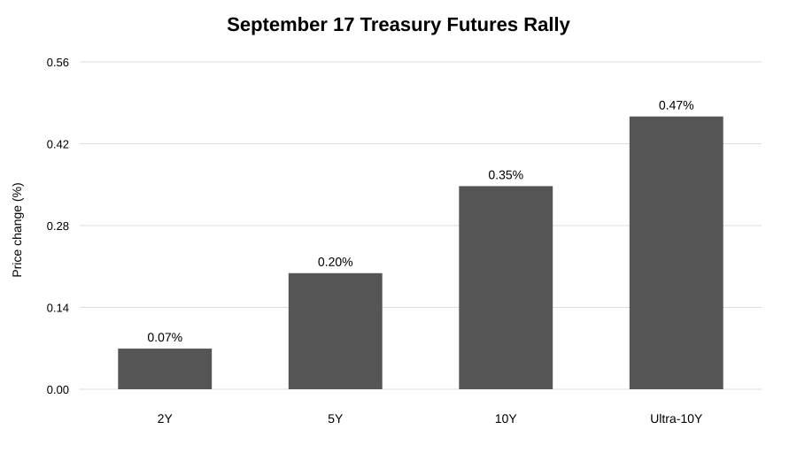

# CASE-001 — September 2026 Fed Hike

## Question

Why did the September 2026 Fed rate increase produce a market response that diverged from the simple tightening framework?

The investigation began with an apparent anomaly:

**Fed hike → higher rates → tighter financial conditions → weaker risk assets**

did not fully describe what happened after the September 16 decision.

The key empirical question became:

**Why did the 10-year real Treasury yield fall approximately 7 bp on September 17 even though the Fed remained hawkish?**

---

## Baseline Framework

Before examining the data, the baseline expectation was frozen as:

Fed tightening  
→ U.S. rates rise  
→ USD strengthens  
→ financial conditions tighten  
→ risk assets weaken.

The case tests where this transmission chain broke.

---

## What Happened

### 10-Year Yield Decomposition

**Takeaway:** The September 17 decline in the 10-year nominal yield was almost entirely a real-yield move. Inflation compensation was approximately unchanged.

### Estimated 10-Year Term Premium

| Date | 10Y Term Premium |
|---|---:|
| Sep 14 | 0.70% |
| Sep 15 | 0.71% |
| Sep 16 | 0.67% |
| Sep 17 | 0.61% |

**Takeaway:** The estimated 10-year term premium declined approximately 6 bp on September 17, closely matching most of the approximately 7 bp decline in the nominal 10-year Treasury yield.

The estimate is model-based and should not be interpreted as a direct measure of the real term premium.

### Treasury Futures Positioning

December 2026 Treasury futures rose across maturities on September 17 while open interest also increased across the 2Y, 5Y, 10Y, and Ultra-10Y contracts.

This weakens a simple broad position-liquidation explanation.

---

## Competing Explanations

### H1 — Pre-Pricing / Position Unwind

The hike itself was heavily anticipated.

Pre-pricing is strongly supported, but the September 17 rally occurred while open interest increased across maturities.

**Status: PARTIALLY SUPPORTED — pre-pricing established; simple broad short-covering weakened.**

### H2 — Fed Credibility / Long-Run Risk Repricing

The original inflation-compensation version is weakened because 10-year inflation compensation was approximately unchanged on September 17.

However, the estimated 10-year term premium declined approximately 6 bp.

**Status: PARTIALLY SUPPORTED — the broader long-duration risk / term-premium channel is supported; attribution specifically to Fed credibility remains incomplete.**

### H3 — Energy-Supply Shock Reversal

Oil reversed sharply during the event window as Saudi supply concerns partially eased.

A simple oil → lower inflation expectations explanation does not fit September 17 because inflation compensation was approximately unchanged.

Energy-risk relief may instead have reduced macro and inflation tail risk.

**Status: PARTIALLY SUPPORTED.**

---

## Conclusion

The September 16–17 episode was not a single-policy-shock event.

The strongest observed relationship is:

- 10Y nominal yield: approximately **-7 bp**
- 10Y real yield: approximately **-7 bp**
- 10Y inflation compensation: approximately **unchanged**
- estimated 10Y term premium: approximately **-6 bp**

The evidence is therefore most consistent with compression in long-duration risk compensation.

Likely contributors include:

- clearer Fed anti-inflation commitment;
- lower rate uncertainty;
- easing energy-supply tail risk;
- simultaneous market repositioning.

The precise contribution of each mechanism cannot be separately identified.

**Final identification status: PARTIAL.**

---

## Framework Update

The original framework:

**hawkish Fed → all yields rise**

is incomplete.

A more useful framework is:

**hawkish Fed**
→ expected short-rate path rises

while simultaneously:

**credibility / lower uncertainty**
→ term premium falls
→ long-end yields may stabilize or decline.

External shocks can reinforce or offset either channel.

The case therefore updates the working framework from a single-direction policy transmission model to a multi-channel model in which the expected policy path and long-duration risk premium can move in opposite directions.

---

## Research Files

- [Baseline Framework](baseline_framework.md)
- [Research Question](question.md)
- [Event Tape](event_tape.md)
- [Hypotheses](hypotheses.md)
- [Intraday Timeline](intraday_timeline.md)
- [Evidence Synthesis](evidence.md)
- [Conclusion](conclusion.md)
- [Framework Update](framework_update.md)

---

## Methodological Note

This case intentionally retains uncertainty.

Where the evidence cannot distinguish among Fed credibility, energy-risk relief, positioning, or other technical mechanisms, the conclusion remains partially identified rather than forcing a single causal narrative.
