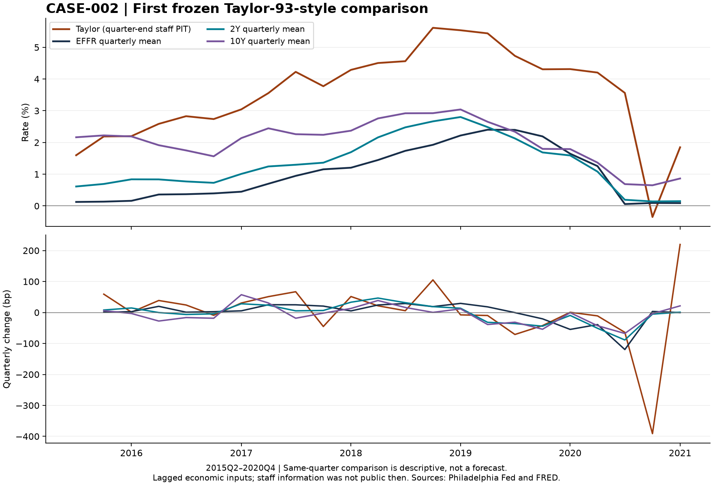

# CASE-002 — First Taylor-93-style evidence

Executed 2026-10-05. Status: first calculation complete; broad mechanism question remains OPEN / UNRESOLVED. Repository base: `435ed6ca593d8aac02d6daa007c73665754988ab`.

## What the first numbers say

The frozen rule generates **23 quarter-end observations, 2015Q2–2020Q4**. Its prescription is generally above the actual policy rate. The mean Taylor-minus-EFFR difference is **+2.52 percentage points**. Similarity in levels is much stronger than similarity in quarterly changes. This does not establish that Taylor explains movements in the 10Y, or that the Fed chose an incorrect rate.

| Signal quarter | Economic quarter used | Taylor % | Actual EFFR % | 2Y % | 10Y % |
|---|---|---:|---:|---:|---:|
| 2015Q2 | 2015Q1 | 1.60 | 0.13 | 0.61 | 2.16 |
| 2018Q4 | 2018Q3 | 5.54 | 2.22 | 2.80 | 3.04 |
| 2019Q4 | 2019Q3 | 4.31 | 1.65 | 1.59 | 1.79 |
| 2020Q2 | 2020Q1 | 3.56 | 0.06 | 0.19 | 0.69 |
| 2020Q3 | 2020Q2 | -0.35 | 0.09 | 0.14 | 0.65 |
| 2020Q4 | 2020Q3 | 1.85 | 0.09 | 0.15 | 0.86 |

Taylor is the quarter-end signal; the three observed rates are **same-quarter means**. The signal therefore is not claimed to predict the already elapsed quarter. Negative Taylor prescriptions are preserved. These sample rows are illustrations; all 23 observations enter the reported statistics.

## Policy comparison first, then 2Y and 10Y

| Same-quarter descriptive comparison | N | Mean difference, pp | Mean absolute distance, pp | RMSE distance, pp | Level correlation | Change correlation |
|---|---:|---:|---:|---:|---:|---:|
| EFFR | 23 | +2.515 | 2.553 | 2.650 | 0.850 | 0.171 |
| 2Y | 23 | +2.202 | 2.245 | 2.350 | 0.868 | 0.286 |
| 10Y | 23 | +1.489 | 1.628 | 1.852 | 0.650 | 0.272 |

Changes are consecutive differences of quarterly signals and quarterly rate means (22 pairs). These are descriptive Pearson correlations with a small, serially dependent sample, not significance tests. Rate-level distances to Treasury yields are not economically maturity-matched forecast errors.

| Quarter-end signal vs following-quarter realization | N | Mean absolute distance, pp | RMSE distance, pp | Level correlation | Change correlation |
|---|---:|---:|---:|---:|---:|
| Following EFFR mean | 23 | 2.555 | 2.661 | 0.830 | 0.170 |
| Following 2Y mean | 23 | 2.267 | 2.419 | 0.757 | 0.133 |
| Following 10Y mean | 23 | 1.685 | 1.971 | 0.464 | 0.116 |

Following outcomes span 2015Q3–2021Q1; 2021Q1 is an outcome, **not a new Taylor signal**. A descriptive no-change comparison, carrying the signal quarter's realized rate mean into the next quarter, gives MAE 0.203 pp for EFFR, 0.222 pp for 2Y and 0.247 pp for 10Y. The much larger Taylor distances do not establish forecast usefulness. This benchmark uses downloaded realized means and has not been certified against historical daily publication timestamps or corrections.

## How a row is calculated

Main formula, in percentage points:

`Taylor = 2 + inflation + 0.5*(inflation - 2) + 0.5*output_gap`

For 2015Q2, the May-quarter YPDGDP vintage gives price levels 108.618 for 2015Q1 and 107.658 for 2014Q1. Four-quarter inflation is `100*(108.618/107.658-1) = 0.891713%`. The 2015-06-10 staff vintage estimates the same 2015Q1 output gap at -1.479739%. The rule gives **1.597699%**, versus the quarter's DFF mean of **0.125604%**. Cell addresses and the full-precision inputs are in the comparison CSV.

This implementation deliberately uses the latest historical observation in the selected quarterly price vintage, matched to the same economic quarter's staff gap. It does not use current-quarter inflation forecasts or a current-quarter gap nowcast. It retains the frozen coefficients, while making the timing choice explicit. The specification is not an exact replication of the original paper and not a claim to use every piece of information available to staff at quarter-end.

## Coverage and availability audit

- **YPDGDP:** the downloaded columns begin `YPDGDP15Q2`, although historical rows begin in 1947. Historical rows inside a 2015 vintage are not 1947 real-time vintages. The documentation independently lists the first monthly vintage as 2015M5. No pre-2015 Taylor signal is filled with revised historical rows. [Philadelphia Fed series](https://www.philadelphiafed.org/surveys-and-data/real-time-data-research/ypdgdp), [documentation, pp. 6–7](https://www.philadelphiafed.org/-/media/FRBP/Assets/Surveys-And-Data/real-time-data/data-files/documentation/gen_doc_GDI.pdf).
- **Staff gap:** downloaded vintage columns span 1996-03-21 through 2020-12-04. Rows extend beyond 2020 because the file includes projections; those rows do not establish later vintage coverage. The main series ends at 2020Q4. Do not infer that a page update in 2026 guarantees 2021 vintages. [Gap source and publication-date downloads](https://www.philadelphiafed.org/surveys-and-data/real-time-data-research/gap-and-financial-data-set).
- **Release lag:** the archive describes a five-year public-release lag. Staff circulation and public access are different clocks. This is a retrospective reconstruction of the staff information set. Public release dates for individual gap records are not verified. A public-market trading backtest cannot use these values at the staff date. [Tealbook data description](https://www.philadelphiafed.org/surveys-and-data/real-time-data-research/greenbook).
- **Date discrepancies:** 19 selected gap dates match the publication workbook exactly. Four selected dates require a conservative later bound: 2017Q1 March 2/3, 2017Q2 June 2/5, 2017Q4 November 30/December 1, and 2018Q3 September 13/14. Matching uses a unique publication date within seven days. These are inferred date mappings, not exact-document verification. All alternatives remain before the same quarter-end.
- **2019Q1:** the selected February vintage ends at 2018Q3, so both inputs refer to two quarters earlier. The missing 2018Q4 observation is consistent with BEA's delayed release on February 28 after the shutdown. We retain the stale observation and flag its two-quarter lag; we do not silently switch vintages. [BEA release](https://www.bea.gov/news/2019/initial-gross-domestic-product-4th-quarter-and-annual-2018).
- **Price revisions:** both inflation endpoints use one historical vintage. Using today's numerator with an old denominator is prohibited. The middle-quarter snapshot omits releases later in the quarter even though staff could have observed them; this is a conservative, reproducible subset of their information.
- **Gap revisions:** archive columns can differ and the provider warns that some records were reconstructed from incomplete/preliminary material. The download is an archived estimate, not an immutable copy of every original staff record. Definitions of output/potential may change. No assertion of perfect historical archival fidelity is made.
- **2021–2026:** no main signal because the downloaded gap file lacks corresponding staff vintages. **1996–2015Q1:** no YPDGDP vintage. The complete exclusion ledger lists each quarter and reason. This sample cannot test post-pandemic inflation tightening or recent convergence.

## Core rates diagnostics

`quarterly_market_diagnostics.csv` contains DFF, DGS2, DGS10, DGS30, DFII10, T10YIE and ACMTP10, plus ACM's internally matched 10Y fitted yield and risk-neutral yield. Every mean has an observation count and last observed date.

| Series | Origin / role | Treatment |
|---|---|---|
| DFF | Board H.15 via FRED; realized policy | Arithmetic mean of all calendar-day entries; all sample quarters complete |
| DGS2 / DGS10 / DGS30 | Board H.15 via FRED; nominal yield diagnostics | Available daily observations only; no weekend or holiday fill |
| DFII10 | Board H.15 via FRED; real yield | Same daily convention; not a direct r* observation |
| T10YIE | FRED nominal-minus-real spread | Inflation compensation, not pure expected inflation |
| ACMTP10 | NY Fed daily ACM sheet; estimated nominal term premium | Retrospective model diagnostic, excluded from Taylor inputs |

[DFF](https://fred.stlouisfed.org/series/DFF), [2Y](https://fred.stlouisfed.org/series/DGS2), [10Y](https://fred.stlouisfed.org/series/DGS10), [30Y](https://fred.stlouisfed.org/series/DGS30), [real 10Y](https://fred.stlouisfed.org/series/DFII10), [breakeven](https://fred.stlouisfed.org/series/T10YIE), [NY Fed ACM](https://www.newyorkfed.org/research/data_indicators/term-premia-tabs).

Current FRED histories can have corrections; they are realized outcomes rather than archived market-release vintages. Historical diagnostics have different start dates (see `source_coverage.csv`), and DGS30 has a known discontinued interval in its earlier history. No missing interval is interpolated. All core diagnostics cover the 23-signal sample with at least 55 observations per quarter. The final partial quarter, 2026Q4, is excluded from the quarterly diagnostics.

ACM is model-estimated and its historical estimates can depend on later estimation data. It is not admitted to the PIT signal. ACM's fitted zero-coupon yield differs from DGS10 constant-maturity yield, so subtracting ACMTP10 from DGS10 is only an approximation, not ACM's exact expected-path series. Never add nominal ACM premium as a third independent component alongside real yield and breakeven. [NY Fed methodology discussion](https://libertystreeteconomics.newyorkfed.org/2014/05/treasury-term-premia-1961-present/).

## Original, main and sensitivity are separate

| Exercise | Status |
|---|---|
| Original Taylor (1993) replication | Not executed. Requires original historical GDP/deflator and original 2.2% trend normalization. Staff gap is not a substitute. |
| Main staff-PIT Taylor-93-style | Executed here, 23 quarters, fixed 2/2/0.5/0.5 parameters. |
| Latest-revised / ex-post comparison | Not executed; must be labeled separately. |
| Modern core-PCE / modern-r* sensitivity | Not executed; cannot fill missing main observations. |

[Original Taylor paper](https://web.stanford.edu/~johntayl/Papers/Discretion.PDF). None of the unexecuted exercises is presented as a successful replication or sensitivity result.

## Reproduce and verify

Raw files are preserved under `raw/`; `sources.json` has exact download URLs and `manifest.json` records SHA-256, size and first-download completion time. FRED's response is a ZIP despite the `rates.csv` filename; the reader handles its separate daily and seven-day CSV members explicitly. `fred_download_notes.txt` preserves FRED's supplied provenance.

In an environment with `requirements.txt` installed, run `python build.py` from any directory. It reads only the preserved inputs and writes research outputs beside itself. To retrieve a fresh snapshot, use each `sources.json` URL in a new directory, retain the new hashes and dates, and compare outputs; do not overwrite the existing snapshot and pretend it is the same run.

Validation includes date ordering, unique period joins, matched economic quarters, positive same-vintage price pairs, complete DFF calendar quarters, missing-data propagation and a future-vintage corruption test. Corrupting all vintages after a historical cutoff leaves that historical signal unchanged. Removing its contemporaneous gap produces a missing result, not a later-vintage backfill. Matched daily `DGS10 - DFII10 - T10YIE` is zero within floating-point tolerance. Full output: `validation.json`.

## Interpretation boundary

This closes the requested first data-and-comparison step, not CASE-002. The original primary question concerns daily 10Y changes and competing mechanisms. Quarterly Taylor data cannot identify daily shocks, market policy surprises, causal dominance or a regime onset. H1–H4 remain unresolved. No optimized parameters, chosen-for-fit windows, production rules, allocations, or GCF changes are introduced.
